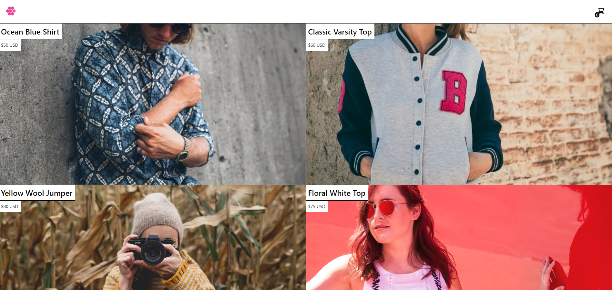

<p align="center">
  

  
 
  <a href="https://github.com/bfukumori/oneweekgraphql/commits/master">
    
  </a>
    
   
   <a href="https://github.com/bfukumori/oneweekgraphql/stargazers">
    
  </a>

  <a href="https://oneweekgraphql-xi.vercel.app/">
    
  </a>
</p>

<h1 align="center">
    
</h1>

<p align="center">
  <a href="#about">About</a> •
  <a href="#features">Features</a> •
  <a href="#how-it-works">How it works</a> • 
  <a href="#tech-stack">Tech Stack</a> • 
  <a href="#author">Author</a> • 
  <a href="#user-content-license">License</a>
</p>

<div align="center"> 
	
</div>

## About

💡 oneweekgraphql - Fullstack eCommerce application using GraphQL.

Project developed during the GrahphQL Course from [One Week GraphQL](https://oneweekgraphql.com/).

---

## Features

- [x] Base layout
- [x] Responsivity
- [x] Add items to cart
- [x] Remove items from cart
- [x] Edit item quantity
- [x] Checkout with stripe API
- [x] Caching with Apollo Client
- [x] Persisting cart state with database (MySQL) and Prisma context
- [ ] Save order information to DB via webhooks
- [ ] Store users in DB to avoid creating same customer each checkout in Stripe
---

## How it works

### Pre-requisites

Before you begin, you will need to have the following tools installed on your machine:
[Git] (https://git-scm.com), [Node.js] (https://nodejs.org/en/).
In addition, it is good to have an editor to work with the code like [VSCode] (https://code.visualstudio.com/)

#### Running the web application

```bash

# Clone this repository
$ git clone git@github.com:bfukumori/oneweekgraphql.git

# Access the project folder in your terminal
$ cd oneweekgraphql

# Install the dependencies
$ npm install

# Run the application in development mode
$ npm run dev

# The app will open on the port: 3000 - go to http://localhost:3000/

```

You`ll need to create an [Stripe] (https://stripe.com/) account to test payments and edit .env.example file with your secrets and database urls to make it works during development.

The live version (https://oneweekgraphql-xi.vercel.app/) can be tested with a test card 4242 4242 4242 4242 (see more in https://stripe.com/docs/testing)

---

## Tech Stack

The following tools were used in the construction of the project:

#### **Application**  ([React](https://reactjs.org/)  +  [TypeScript](https://www.typescriptlang.org/))

- **[ApolloGraphQL](https://www.apollographql.com/)**
- **[Prisma](https://www.prisma.io/)**
- **[Stripe](https://stripe.com/)**
- **[Next](https://nextjs.org/)**
- **[Tailwindcss](https://tailwindcss.com/)**
- **[Codegen](https://www.graphql-code-generator.com/)**

---
## Author

<a href="https://www.facebook.com/bruno.fukumori.9/">
 
 <br />
  
 <sub><b>Bruno Fukumori</b></sub></a> <a href="https://www.facebook.com/bruno.fukumori.9/" title="facebook"></a>
 <br />

[](https://twitter.com/hi_fukujp) [](https://www.linkedin.com/in/bfukumori/) 
[](mailto:brunofukumori@gmail.com)

---

## License

This project is under the license [MIT](./LICENSE).

---
